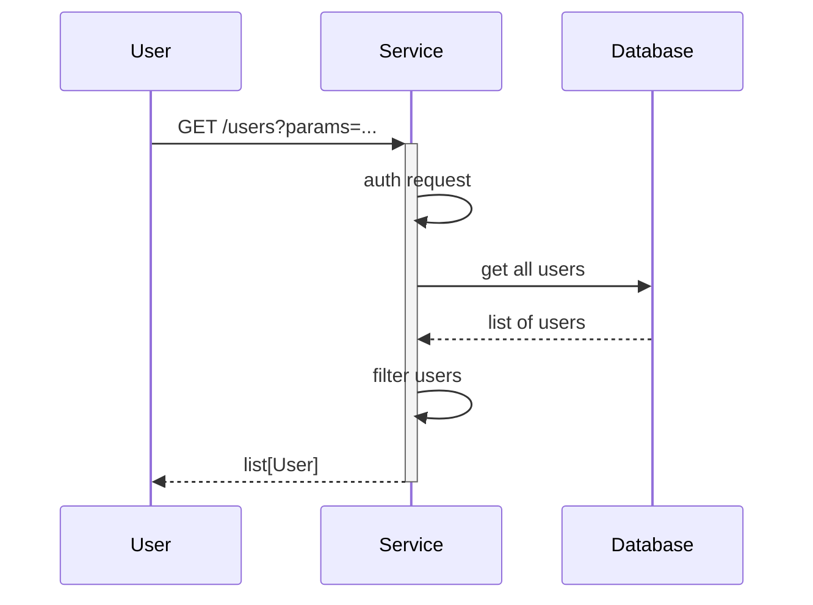

# GitHub Permissions Elevation

[](https://github.com/nhs-england-tools/github-permissions-elevation/actions/workflows/cicd-1-pull-request.yaml)
[](https://sonarcloud.io/summary/new_code?id=github-permissions-elevation)

Currently there are specific tasks within GitHub that require the "Owner" permission. We would like to avoid individuals having long standing super-user permissions on their user. This app will enable users to operate as normal member level permissions for the majority of their tasks, only assuming the "Owner" level permissions when they require them. This will also provide an audit of when these permissions are assumed and the reason that they are assumed for.

This app will monitor for an issue being created requesting for the creator to be elevated to an Owner of the GitHub Organization. This user should be from a specific GitHub Team, and when another member of that team responds with "approved" or some other positive response, the app will update the user to "Owner". After a set period of time the app should demote the user back to a normal permission level.

## Table of Contents

- [GitHub Permissions Elevation](#github-permissions-elevation)
  - [Table of Contents](#table-of-contents)
  - [Setup](#setup)
    - [Prerequisites](#prerequisites)
    - [Configuration](#configuration)
  - [Usage](#usage)
    - [Testing](#testing)
  - [Design](#design)
    - [Diagrams](#diagrams)
    - [Modularity](#modularity)
  - [Contributing](#contributing)
  - [Contacts](#contacts)
  - [Licence](#licence)

## Setup

There are a few steps to configure the organisation to facilitate this app.

Clone the repository

```shell
git clone https://github.com/nhs-england-tools/github-permissions-elevation.git
cd nhs-england-tools/github-permissions-elevation
```

### Prerequisites

To run locally it is assumed that you have Python 3.12 installed.

```bash
sudo add-apt-repository ppa:deadsnakes/ppa
sudo apt install python3.12
sudo apt install python3.12-venv
```

#### Organisation Preparation

##### Create a team

This team is for your trusted users to be members of. Members of this team will be able to request to be elevated to an Owner and will be able to approve requests to be elevated to Owner. From the organisation page in GitHub navigate to Teams

1. Create a new team
1. set the Team name to `can escalate to become an owner`
1. Set Team visibility to `Secret`
1. Ensure that Team notifications are set to `Enabled`
1. Click the button to `Create team`
1. Add the appropriate team members to this team

##### Create a Repository

The app should only be notified when new issues are created on specific repositories, namely we want a dedicated repository that org Owners can use to request elevation. Therefore, in your target Org create a new repository called `ElevateMeToOwner` this should be a *Private* repository that can only be accessed by the team created above.

#### GitHub App Setup

Create a GitHub App with the necessary permissions to manage organization members and read issues.
Install the app in your GitHub organization.

##### Steps to create GitHub App

1. Navigate to your GitHub User
1. In the left hand navigation select "Developer Settings"
1. Under GitHub Apps select the "New GitHub App" button.
1. Provide the Apps name as `ElevateMeToOwner`
1. In the Write text box provide some information about the app.
1. In Homepage URL paste the link to your GitHub repository README file.
1. In the Webhook section, ensure that the checkbox next to Active is ticked.
1. In the Webhook URL paste in the link output from the Terraform run.
1. Create a secret for the token `openssl rand -base64 32` and paste it in to the Secret field.
1. Expand the "Repository permissions" drop down and scroll down to "Issues" select `Access: Read and write`
1. Expand the "Organization permissions" drop down and scroll down to "Members" select `Access: Read and write`
1. Under "Subscribe to events" ensure that the checkbox for "Issues" and "Issue comment" is selected.
1. Under "Where can this GitHub App be installed?" ensure that `Any account` is selected.
1. Press the `Create GitHub App` button.

###### Generate a Private Key

You *must* create a private key to be able to install your GitHub app.

1. Press the `generate a private key` link from the app page
1. Press the `Generate a private key` button.
1. This will download your private key to your local machine.
1. We will need to store this key as an SSM parameter in AWS.

###### Create a Client Secret

To authenticate as the app you need to generate a Client Secret. From the app settings page:

1. Press the Generate a new client secret button
1. Copy the provided client secret
1. This should then be stored in SSM parameter store

###### Update AWS SSM entries

We now need to ensure that the necessary information is stored in our AWS SSM parameters for this installation.

1. private key
1. client id
1. secret - this is the secret for the client
1. webhook secret
1. app id
1. installation ID

###### Install the app to your Org

From the GitHub app page select the `Install App` option from the left hand menu.
You will be shown all of the organisations you can install to as well as your user - please select the organisation you wish to install to and press the `Install` button.

In the Install dialogue select to Install on your org to `Only select repositories`
Select the `ElevateMeToOwner` repository you created earlier.
Review the permissions being requested - these are:

1. Read access to metadata
1. Read and write access to issues and members

Press the `Install` button.

### Configuration

Installation and configuration of the toolchain dependencies

```shell
make config
```

## Usage

After a successful installation and Terraform apply follow the steps above to configure the app in AWS lambda.

### Testing

There are `make` tasks for you to configure to run your tests.  Run `make test` to see how they work.  You should be able to use the same entry points for local development as in your CI pipeline.

## Design

### Diagrams

The [C4 model](https://c4model.com/) is a simple and intuitive way to create software architecture diagrams that are clear, consistent, scalable and most importantly collaborative. This should result in documenting all the system interfaces, external dependencies and integration points.


The source for diagrams should be in Git for change control and review purposes. Recommendations are [draw.io](https://app.diagrams.net/) (example above in [docs](.docs/diagrams/) folder) and [Mermaids](https://github.com/mermaid-js/mermaid). Here is an example Mermaids sequence diagram:



### Modularity

Most of the projects are built with customisability and extendability in mind. At a minimum, this can be achieved by implementing service level configuration options and settings. The intention of this section is to show how this can be used. If the system processes data, you could mention here for example how the input is prepared for testing - anonymised, synthetic or live data.

## Contributing

Describe or link templates on how to raise an issue, feature request or make a contribution to the codebase. Reference the other documentation files, like

- Environment setup for contribution, i.e. `CONTRIBUTING.md`
- Coding standards, branching, linting, practices for development and testing
- Release process, versioning, changelog
- Backlog, board, roadmap, ways of working
- High-level requirements, guiding principles, decision records, etc.

## Contacts

Provide a way to contact the owners of this project. It can be a team, an individual or information on the means of getting in touch via active communication channels, e.g. opening a GitHub discussion, raising an issue, etc.

## Licence

> The [LICENCE.md](./LICENCE.md) file will need to be updated with the correct year and owner

Unless stated otherwise, the codebase is released under the MIT License. This covers both the codebase and any sample code in the documentation.

Any HTML or Markdown documentation is [© Crown Copyright](https://www.nationalarchives.gov.uk/information-management/re-using-public-sector-information/uk-government-licensing-framework/crown-copyright/) and available under the terms of the [Open Government Licence v3.0](https://www.nationalarchives.gov.uk/doc/open-government-licence/version/3/).
